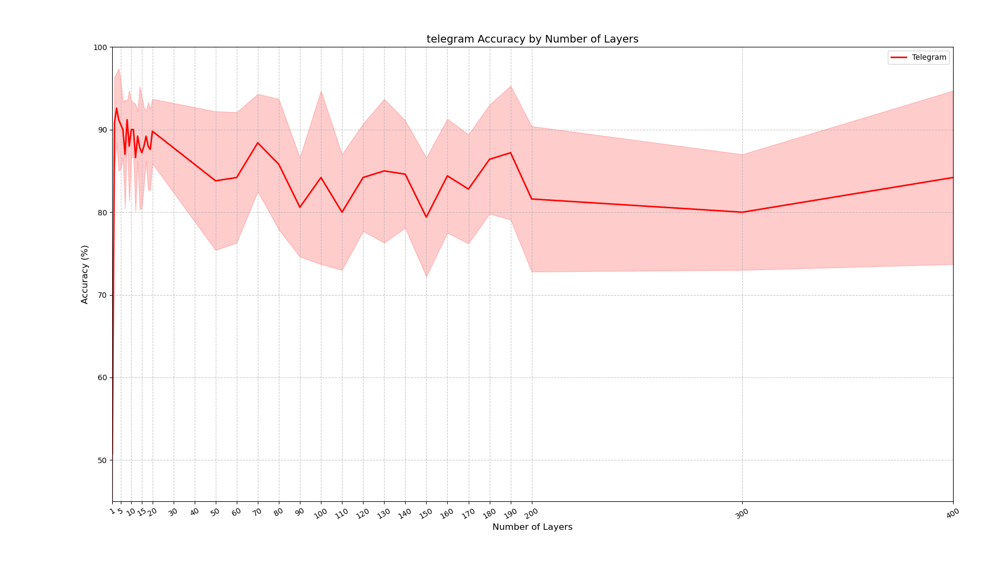

#  Beyond the Isomorphism Trap
Our paper [Beyond the Isomorphism Trap: A Structure-Feature Dichotomy for GNN
Expressiveness].

## Requirements

This repository has been tested with the following packages:
- Python == 3.9 or 3.10
- PyTorch == 2.1.2
- PyTorch Geometric == 2.4.0
- torch-scatter==2.1.2
- torch-sparse==0.6.18

Performance may vary slightly with different version of Python, GPU, cuda, PyTorch.
## Installation Instructions

1. Follow the official instructions to install [PyTorch](https://pytorch.org/get-started/previous-versions/).
2. Install [PyTorch Geometric](https://pytorch-geometric.readthedocs.io/en/latest/notes/installation.html).
3. For `pytorch-scatter` and `pytorch-sparse`, download the packages from [this link](https://pytorch-geometric.com/whl/torch-2.3.0%2Bcu121.html) according to your PyTorch, Python, and OS version. Then, use `pip` to install them.

By following these steps, you can resolve compatibility issues and avoid segmentation faults.


## Important Hyper-parameters
### Dataset
Specify the name of the dataset you want to use. The available datasets are categorized as follows:

- **Directed Datasets**:
  - **Citation Classification**:
    - `citeseer/`
    - `cora_ml/`
    - `dgl/pubmed`
  
  - **Webpage Traffic Classification**:
    - `WikipediaNetwork/squirrel`
    - `WikipediaNetwork/chameleon`
  - **Social Network**:
    - `telegram/`

- **Models**:
  - `Dir-GNN`
  - `GCN with selfloop`:   args.add_selfloop=1   args.net='GCN'
  - `GCN without selfloop`:   args.add_selfloop=0   args.net='GCN'
  - `single layer with k-hop neighbors`: args.net='GCNAk'  args.Ak=10 
- **Option of Propagation**:
  - `original directed`: args.to_undirected=0  args.to_reverse_edge=0
  - `bidirectional`: args.to_undirected=1
  - `reverse direction`: args.to_reverse_edge=1
- **Other Options**:
  - `enable density computation for different hop neighbors`: args.num_edge=1
  - `enable incidence normalization for GCN`: args.gcn_norm=1
  - `node feature to be all 1`: args.all1=1
  - `node feature to be node degree`: args.degfea=1(in degree), -1(out degree), 2(both degree), 0(not using degree)


### How to Run

- **(1) To run and get the result in Figure 3**:
  - For Chameleon and Squirrel dataset:
    - Comment out relative settings in best_hyperparameters.yml, then run: 

      ```
      python3 main.py  --net='ScaleNet'  --use_best_hyperparams=1   --Dataset='WikipediaNetwork/chameleon'  --add_selfloop=0
      ```
    - Then copy the results to ./figureDraw/nochange_draw.py and run to draw figures.
  - For Telegram dataset:
    - Comment out relative settings in best_hyperparameters.yml, then run this batch file:
      ./nest_tel.h
    - Then copy the results to ./figureDraw/tele_layer.py and run to draw figures.
  
- **(2) To run and get the results in Figure 4**:
 - To get the blue line of growing layers:
  ```
  python3 main.py  --net='GCN'  --add_selfloop=1  --layer=8  --Ak=0
  ```
  - To get the red line of growing neighbors:
  ```
  python3 main.py  --net='GCN'  --add_selfloop=1  --Ak=8   --layer=1
  ```
  - To get the green line of growing neighbors and layers:
  ```
  python3 main.py  --net='GCNAk'  --add_selfloop=1  --Ak=8  
  ```
  - To get the black line of density, run the following code and the result will be printed. Then copy the results to ./figureDraw/draw.py to draw figures.
  ```
  python3 main.py  --add_selfloop=1  --num_edge=1  
  ```
 - To run and get the results in Figure 5**, just add --args.to_reverse_edge=1 for reverse propagation, add --to_undirected=1 for bidirectional propagation.
 

- **(3) Batch running**:
  - Revise following file to cater your needs:
  ```
  ./net_nest.h &
  ```

- **(4) To get the results in Table 2**:
  - Enable all requirements in best_hyperparameters.yml exception inci_norm and run, 
  for instance, the code below is no features by setting all1 to be 1, and row normalization:
  ```
  python3 main.py   --net='GCN'   --use_best_hyperparams=1  --inci_norm='row'   --all1=1
  ```

### Others
GCN in this branch used the official GCN, not my revision.

The image below shows the performance as the number of layers increases 
for the Telegram dataset, without adding self-loops. 

The model used is [ScaleNet](https://github.com/Qin87/ScaleNet/tree/July25), 
which is equivalent to [DirGNN](https://github.com/emalgorithm/directed-graph-neural-network) with bi-directional aggregation, 
but without the jumping-knowledge function. 
This ensures that the performance reflects the effect of exactly the specified number of layers.




## License
MIT License

## Acknowledgements

The code is implemented based on [DiGCN](https://github.com/flyingtango/DiGCN),  [DirGNN](https://github.com/emalgorithm/directed-graph-neural-network)and 
[MagNet](https://github.com/matthew-hirn/magnet).

